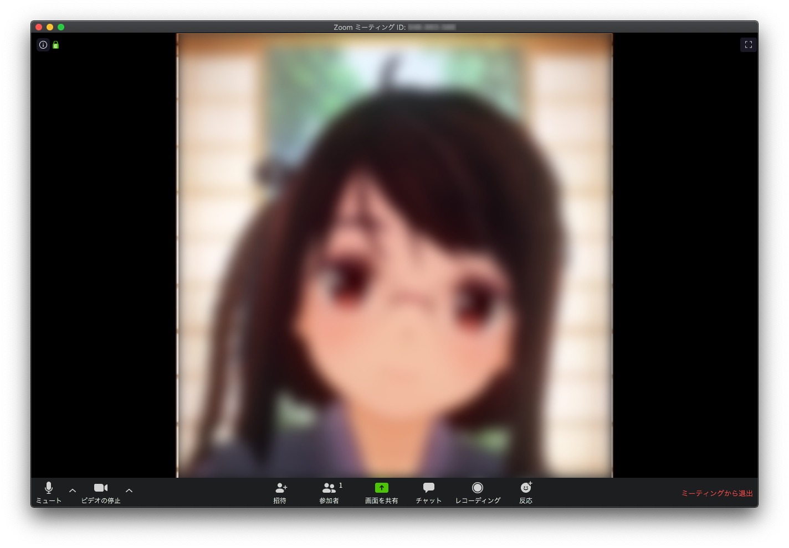
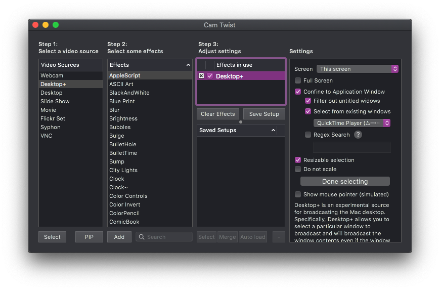

新型コロナウイルス感染症（COVID-19）の影響で原則リモートワークになったため，研究室のメンバと話す機会が取りづらくなった．
オンライン会議システムで常時開放の雑談部屋をつくってみたものの，なにか参加するきっかけがほしい．
そんな折，研究室のドクターがFaceRigでオンライン雑談部屋に出現した．
そこで，自分もバ美肉に挑戦してみた．
本記事にて受肉に用いた技術およびバ美肉ミーティングの注意事項を述べる．

※本記事はあくまで技術検証であり，実際の使用を勧めたり保証したりするものではありません．

<!--more-->

{}

## きっかけ

1. 研究室のドクターがFaceRigでオンライン雑談部屋に出現
2. 自分もやってみようと思ったがMacでFaceRigは動かない
3. 調べていくうちに以下のツイートに遭遇
    <blockquote class="twitter-tweet">
リモートワークのオンライン会議をしたら…<a href="https://twitter.com/hashtag/%E3%82%AB%E3%82%B9%E3%82%BF%E3%83%A0%E3%82%AD%E3%83%A3%E3%82%B9%E3%83%88?src=hash&amp;ref_src=twsrc%5Etfw">#カスタムキャスト</a> のキャラで上司が <a href="https://twitter.com/hashtag/%E3%83%90%E7%BE%8E%E8%82%89?src=hash&amp;ref_src=twsrc%5Etfw">#バ美肉</a> してました <a href="https://t.co/cdKLRlokqy">pic.twitter.com/cdKLRlokqy</a>
&mdash; カスタムキャスト公式 (@customcast) <a href="https://twitter.com/customcast/status/1230108061206904833?ref_src=twsrc%5Etfw">February 19, 2020</a></blockquote> 
4. 此方もやらねば…無作法というもの…

## 受肉編

まずはカワイイになろう．

### MacでFaceRig使えない問題

バーチャルアバターを表情に合わせて動かすソフトウェアといえばおなじみなのが[FaceRig](https://store.steampowered.com/app/274920/FaceRig/?l=japanese)．
しかし悲しいかな，これはWindows上でしか動作しないのだ．

他にも同様のソフトウェアの候補はあるものの，Macでいい感じに動作するものはなかなか存在していない．

### あなたがiPhone X以降を持っている理由＝受肉

ところが，同じApple社製品の中でもダントツに利用者数の多いiPhone向けにはホットな市場展開が行われており，高性能なアプリが数多くリリースされている．
しかも，iPhone X以降であればFaceIDを用いた高度な顔形状のトラッキングまで使えてしまうメリットもある．
そんな高性能なiPhoneをわざわざ高いお金を払って買っているのに，ツイッターするだけの装置にするのはもったいない！
したがって，今回はiPhone上でバーチャルアバターを表情に合わせて動かすアプリを動作させ，その映像を取り込んでオンライン会議の映像として用いることにした．

### システム構成

#### ハードウェア

- iPhone XS（バーチャルアバター映像生成用）
- MacBook Pro 15-inch（iPhoneの映像キャプチャ，仮想カメラ生成，およびオンライン会議用）

iPhoneとMacはLightningケーブルで有線接続する．

#### ソフトウェア

- （iOS）バーチャルアバターを表情に合わせて動かすアプリ
- （Mac）QuickTime Player（iPhoneの画面キャプチャ用）
- （Mac）[CamTwist](http://camtwiststudio.com/)（QuickTime Playerの映像を仮想的なカメラ入力に変換する用）
- （Mac）適当なオンライン会議ソフトウェア（オンライン会議用）

#### 動作手順

1. iOS側のアプリを操作して，表情に合わせたトラッキングのプレビュー画面まで進める．これ以降の操作はすべてMac側で行う．
2. QuickTime Playerを起動し，「ファイル」→「新規ムービー収録」を選択する．
3. 録画用のウインドウ下部にあるコントロール中の録画ボタンの右脇にあるプルダウンメニューからiPhoneを選択し，画面キャプチャを開始する
4. CamTwistを起動し，「Video Sources」として「Desktop+」を選択する．
5. 「Effects」は無視して「Effects in use」の「Desktop+」を選択する．
6. 「Settings」上で，「Screen」を「This screen」に設定した上で，その下のチェックボックス中から「Confine to Application Window」にチェックを入れ，「Select from existing windows」の下にあるプルダウンメニューからQuickTime Playerを選択する．
7. オンライン会議システム（Zoom, Skype, Teams, etc.）を起動し，設定からビデオの入力ソースを「CamTwist」に切り替える．
8. ここまでの手順を行うとキャプチャされたものがオンライン会議システムのプレビューに映るはず．
9. CamTwistに戻り「Settings」の調整を行う．「Resizable selection」にチェックを入れ，「Select capture area」ボタンを押す．
10. 画面上に四角形の枠が表示されるので，オンライン会議システムにいい感じにキャプチャ映像が映るように枠の位置を調整する．
11. 調整が済んだら「Done selecting」ボタンを押す．
12. ここまでの操作でCamTwistの画面は以下のようになるはず．
    

## 声帯編

どうせなら声もカワイイにしたい（このあたりの好みは人によって分かれるので蛇足かもしれない）．

本節では次のような声を作成するまでの取り組みを紹介する．

<audio src="assets/hello.mp4" controls>
  <a href="assets/hello.mp4">サンプルボイスを再生</a>
</audio>

### Logic Pro Xという選択肢

Macで使えるソフトウェアボイスチェンジャーはいろいろあるが，好みの声帯に厳選するために弄れるパラメータが少ない．
一方で，雑談のためだけにハードウェアエンコーダを購入するのは金銭面のハードルが高い．

そこで今回は音楽制作ソフトであるLogic Pro Xをソフトウェアボイスチェンジャーとして用いた．
Logic Pro XはApp Storeから直接購入するとかなり高価なアプリだが，学生用のバンドルを購入することで破格の値段で利用可能である．
また，単にボイスチェンジャーとしてのみならず，各種フィルタやエフェクタを適用して好みの声帯を模索できる利点がある．

### システム構成

#### ハードウェア

- 適当なマイク（素の声を拾うため）
- ヘッドフォン（声帯を調整するため，できればノイズキャンセリング機能付きの密閉型がよい）

#### ソフトウェア

- Logic Pro X（ボイスチェンジャー兼フィルタ兼エフェクタ）
- [soundflower](https://github.com/mattingalls/Soundflower/releases/)（仮想オーディオインタフェース作成用）
- （Mac）適当なオンライン会議ソフトウェア（オンライン会議用，受肉編と同じ）

#### 動作手順

1. あらかじめsoundflowerをインストールし，システムを再起動しておく．
2. Logic Pro Xを起動し，「ファイル」→「新規…」を選択する．
3. 「オーディオ」タブを選択し，マイクを入力1のデバイスに，ヘッドフォンをオーディオ出力のデバイスに指定する．
4. トラック上のオーディオ1の「I」ボタンをオンにして入力モニタリングを開始する
5. ミキサー上部のAudio FXから「Pitch」→「Vocal Transformer」→「モノラル」を選択し，いい感じにパラメータを弄る．
6. 適宜Audio FXにフィルタやエフェクタをぶち込んで好みの声帯になるまで調整する．
7. ここまでで声帯を完成させる．
8. オンライン会議システムを起動し，オーディオ設定の入力デバイスをSoundflower (2ch)に変更する．

## 注意事項

以下，オンライン会議でバ美肉する際の注意事項を述べる．

### 性癖はバラしても個人情報はバラすな

自分でカスタマイズしたモデルを用いてバ美肉すると性癖がバレる．
しかし，それ以上に個人情報の漏洩は危険である．

今回の構成ではiPhoneの画面をそのままキャプチャしているので，プッシュ通知も同時にキャプチャされてしまう．
そこにあなたの個人情報や通知のメッセージを送ってきた相手の個人情報が載っている可能性は十分にありえる．
性癖はバレても困るのは自分だけだが，他の人を巻き込む事故は避けたいものである．

幸い，iPhoneにはプッシュ通知をオフにする「おやすみモード」機能がある．
iPhoneの設定アプリから「おやすみモード」を選択し，「おやすみモード」のトグルをオンにする，あるいは画面右上のコントロールセンターで月のボタンをオンにすることで「おやすみモード」を起動できる．
また，設定アプリ「おやすみモード」の下側にある各種設定も必ず行うべし．

- 「通知」について「常に知らせない」にチェックを入れる  
- 「着信を許可」について「誰も許可しない」を選択する  
- 「繰り返しの着信」のトグルをオフにする

### アプリの利用規約はよく読み込め

リモートワーク時の服装を見せたくないとか雰囲気を和ませたいというニーズから，オンライン会議の場で実際にバ美肉したい人間は一定数存在すると思われる．
実際にバ美肉をする際には，アプリの利用規約に違反していないか確認する必要がある．
例えば，アプリが法人利用を制限している，あるいは法人利用に許可を取るように求めているケースでは，会社組織内の会議に用いるとこれに抵触する恐れがある．
また，アプリ内部の配信システムを用いずにキャプチャ映像を配信する行為そのものが禁じられているケースもある．

他にも，VRMなどの配布されたモデルをバ美肉する際には，別途モデルの利用規約に違反していないかチェックすることも必要である．

### セキュリティの懸念

CamTwistもsoundflowerも，アプリケーションあるいはインストーラが開発者の署名のない状態で配布されており，かつOSに機能拡張を行うソフトウェアであることから，社用Macなど厳密なセキュリティが求められる場合には利用しないほうがよいかもしれない．
