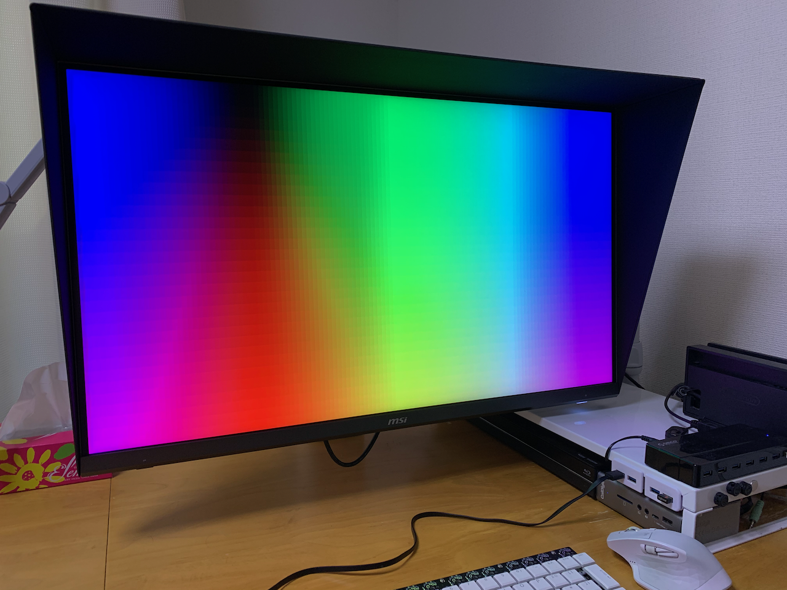

[前回の記事](/posts/update-display-by-extended-warranty/)で代替品として購入したMSI Creator PS321URVを使ってみていいと思った点・注意すべき点等をメモしておく．

<!--more-->

{}

## いいと思った点

- 映像入力端子が多い
    - HDMI×2，DP×1，Type-C×1
- 電源内蔵
- 画面が明るい
    - DisplayHDR 600
    - 400nit（瞬間最大600nit）
- 輝度を100%にしても色味やユニフォミティが崩れない
    - 旧モニタは75%を超えると崩れていた
- バックライト漏れがない
    - 4辺ともベゼルレスではないので漏れにくい
- 遮光フードが付属している
    - マグネットでかんたんに付けられる
    - 埃よけとして使える
- OSDメニューで項目選択時に影響を受ける他の項目がわかる
    - 例えばFreeSyncをオンにするとPIP/PBP・画面の比率変更・ズームができなくなることが示される
- スティックを上下左右に倒して起動するショートカットを自由に割り当てられる
- Macで疑似解像度1080p/2160pとした場合，アンダースキャンが設定可能
    - 映像の端が画面の内側になるようにスケーリングできる
    - Macの環境設定＞ディスプレイから設定可能
- [エルミタージュ秋葉原のレビュー](https://www.gdm.or.jp/review/2021/0304/382118/3)で言及されているものの，そこまでエッジやロゴの反射は気にならない
    - 遮光フードを付けているせいかも

## 注意すべき点

- USB Type-Cは映像出力のみでUSBハブ/SDカードリーダは別途ケーブル接続が必要
- USB Type-Cの給電能力は5V/3A
    - USB PDには非対応
- 制御用アプリケーションはWindows版のみ
- スタンバイ時の電源ボタンのLEDランプは消せなさそう
    - ぼやっとした光り方なのでそこまで気になるものではない
- モニタアームのプレートは付属のスペーサをモニタに取り付けてその上に固定する
    - 取り付け部分の凹みの周囲にプラスチックのでっぱりがあり，そのままだとモニタアームのプレートと干渉する
- OSD操作用のスティックが裏側にあるため手を伸ばして操作する必要がある
- スピーカは付いていない
    - 正直2W程度のスピーカであれば無くてもいい
- ローカルディミングはオマケ程度？
    - 画面下部からの8箇所のLEDで縦長8つの領域を制御している感じ
    - 暗い絵から瞬時に明るい絵に切り替わったときに画面が白っぽくなる（トンネルを抜けて一瞬視界が白ける感覚）
    - オン・オフの切り替えはできる
- 黒の黒さは普通のIPS並
- クリエイター向けを謳ってはいるが，高価なカラーマネジメントモニターには及ばない
    - 8bit+FRC
    - DCI-P3カバー率95%

## これいる？な点

- 画面下部のベゼル上のmsiロゴ
- モニタ裏のRGBライト
    - OSDからオフにはできる
- モニタ裏のドラゴンマーク
- アナログ音声入力端子があり，映像入力端子からのデジタル音声との間で入力ソースを切り替えられる機能
    - 高級アナログアンプを介した音をモニタに入れて，モニタの脇の音声出力端子からさらに音を取る，なんてケースが有るのだろうか？

## 未検証な点

- 付属スタンド
- プロ目線での色ムラがあるかどうか
- 故障時の修理対応
- 耐久性
    - 旧モニタは4隅が変色しやすかった
