{}

## 選択肢

### バックプレートの選択

MJ65は，使用するキーキャップのステップの有無を考慮して，角度のついたバックプレートと角度のつかないバックプレートを選択できます．
角度のついたほうは`compact-board`というファイル名で，3Dモデルのみ提供しています．
角度のつかないほうは`compact-plate`というファイル名で，2Dカットラインと3Dモデルの双方を提供しています．
また，角度のつかないほうの3Dモデルには，`compact-cbore-light-plate`というファイル名で，軽量化と皿ネジへの対応を施した版も提供しています．

基本的にすべてのバックプレートで作成手順は同様ですが，バックプレートの種類によって使用するネジとネジ止めの方法が若干変わります．

### キースイッチの選択

MJ65は，キースイッチの好みを考慮して，Cherry MX互換，Alps互換，およびKailh Chocキースイッチを選択できます．

使用するキースイッチの種類によって，使用するトッププレートの種類とネジの長さが変わります．

### キーレイアウトの選択

MJ65は，USライク配列，Default（JIS）配列，およびSplit-Space（JIS）配列を基本レイアウトとして選択できます．また，各基本レイアウトに対して，右下のキー数を1つ増やしたレイアウト，最上部の独立ファンクションキーを実装したレイアウトが選択できます．なお，独立ファンクションキーはファームウェアの調整が必要です（マクロあり）．詳細は[こちらのページ](../layout/#extra-keys)を参照ください．

選択したレイアウトによって，必要なキースイッチの個数とキーキャップの種類・個数が変わります．

## 部品リスト

MJ65を1台作成するために必要な部品のリストです．
備考欄にパーツのデータまたは商品ページ（一例）へのリンクを貼っておきます．

1台あたり，すべてコミコミでおよそ20,000円前後になるはずです．
（もっと安く実装できるなら，ぜひ教えてください．）

### 共通

|名前|個数|リンク・備考|
|:--|--:|:--------|
|PCB|1|https://github.com/urushiyama/MJ65-PCB 1.6mm厚を想定．|
|Adafruit Itsy Bitsy 32u4|1|http://ssci.to/3625 3V版を想定，5V版はファームウェアの調整が必要です．|
|2.0mm高 スプリングピンヘッダ 1列12ピン|3|http://ssci.to/3763 内一本はカットして使用．|
|キースイッチ Cherry MX互換/アルプス互換/Kailh Choc (Low Profile)|62-66 (+1)(+11)|キーレイアウトにより個数が変動[^1]．PCB/Plate Mount両対応．|
|キーキャップ（キースイッチに対応するもの）|キースイッチと同数|キーレイアウトにより必要な形状・個数が異なる．|
|ダイオード 1N4148|キースイッチと同数|http://akizukidenshi.com/catalog/g/gI-00941/ キーレイアウトにより個数が変動[^1]．|
|トッププレート|1|https://github.com/urushiyama/MJ65-Plate/tree/master/top-plate キースイッチ固定用．キースイッチの種類によって異なる[^2]．|
|はんだ|1-|精密プリント基板用はんだを推奨，500円程度のもので十分余る．|

### ネジ類

使用するバックプレート（2パターン）xキースイッチ（2パターン）の計4パターンあります．

#### 角度のついたバックプレート+Kailh Chocスイッチ使用時

|名前|個数|リンク・備考|
|:--|--:|:--------|
|M2低頭ネジ 6mm|14-|プレートとPCB固定用．|
|M2ナット 1.6mm厚|14-|ボトムプレートとPCBスペーシング用．|

#### 角度のついたバックプレート+Kailh Choc以外のキースイッチ使用時

|名前|個数|リンク・備考|
|:--|--:|:--------|
|M2低頭ネジ 7mm|14-|プレートとPCB固定用．|
|M2スペーサー 両メネジ3mm|14-|トッププレートとPCB固定用．|
|M2スペーサー メネジオネジ3mm+3mm|14-|ボトムプレートとPCB固定用．|

#### 角度のつかないバックプレート+Kailh Chocスイッチ使用時

|名前|個数|リンク・備考|
|:--|--:|:--------|
|M2小皿ネジ 5mm|14-|プレートとPCB固定用．|
|M2スペーサー メネジオネジ3mm+5mm|14-|バックプレートとPCB固定用[^3]．|
|M2スペーサー 両メネジ1mm|14-|トッププレートとPCB固定用[^3]．|
|M2ナット 1.2mm厚|14-|トッププレートとPCB固定用．|

#### 角度のつかないバックプレート+Kailh Choc以外のキースイッチ使用時

|名前|個数|リンク・備考|
|:--|--:|:--------|
|M2小皿ネジ 8mm|14-|プレートとPCB固定用．|
|M2スペーサー メネジオネジ3mm+3mm|14-|バックプレートとPCB固定用．|
|M2スペーサー 両メネジ3mm|14-|トッププレートとPCB固定用．|
|M2超低頭ネジ 3mm|14-|トッププレートとPCB固定用．|

### Cherry MX互換およびAlps互換キースイッチ使用時

|名前|個数|リンク・備考|
|:--|--:|:--------|
|スタビライザー PCBマウント 1.75u|2-3|レイアウトにより異なる[^4]．|
|スタビライザー PCBマウント 6u|0-1|レイアウトにより異なる[^5]．|

### オプショナル

|名前|個数|リンク・備考|
|:--|--:|:--------|
|追加トッププレート|0-1|https://github.com/urushiyama/MJ65-Plate/tree/master/extra-top-plate 独立ファンクションキー行を実装する場合必要．キースイッチの種類によって異なる[^2]．|
|マイコンカバー|0-1|https://github.com/urushiyama/MJ65-Plate/tree/master/cover マイコンボードを隠したい場合必要．|

[^1]: US_like:62，default:65，split-space:66を基本として，それぞれ，右下のキー数を増やす場合+1，独立ファンクションキー行を実装する場合+11
[^2]: Cherry MX互換またはアルプス互換の場合`Univ-top-plate-mx-alps`，Cherry MX互換またはKailh Chocの場合`Univ-top-plate-mx-choc`．Cherry MX互換キーを後者のほうが穴が小さいため，正確な大きさで出力できる場合は後者を選択してください．
[^3]:（入手性が悪すぎるため）実際制作できるか不明．作者は試していません:smiling_imp:
[^4]:`us_like`または`1app_us`ならば3個，それ以外は2個|
[^5]:`us_like`または`1app_us`ならば1個，それ以外は0個|

## 組み立て手順

- 最上段の独立ファンクションキーの組み立て手順はいずれ追記します．

### 1. ダイオードのはんだ付け

ダイオードを`Dx_y`とシルクが印字された箇所に**シルク印字の反対側にダイオードがつくように**はんだ付けします．
ダイオードのカソードを四角いパッド（写真中の白い四角で囲った側）にはんだ付けしてください．

シルクの印字で`Dx_y`と記入された箇所のダイオードが，シルクの印字で`SWx_y`と書かれたキースイッチに対応します．
選択したレイアウトによってはんだ付けが不要な箇所が生じるので，レイアウトとシルクの印字を確認してください．
なお，実装が必要な箇所がよくわからない場合は，すべての箇所にダイオードをはんだ付けすると良いでしょう．

{}

{}

{}
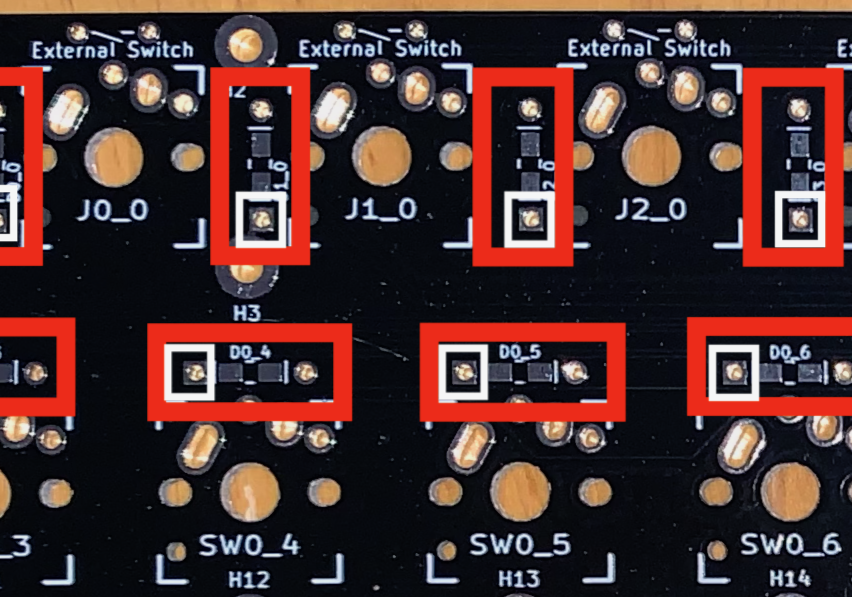
{}

{}

{}

{}
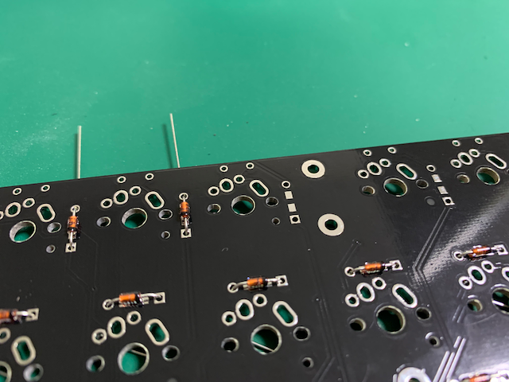
{}

{}

{}

### 2. キースイッチのトッププレート，追加トッププレートへのはめ込み

キースイッチをレイアウトと照らし合わせながら，トッププレートにはめ込みます．
この際，PCBとトッププレートを重ね合わせて，キースイッチの足が基板のスルーホールに入るか確認しながら作業すると良いでしょう．

### 3. スタビライザーの取り付け（Cherry MX互換およびAlps互換キースイッチ使用時のみ）

配列によって取り付けの位置，個数，種類が変わります．
写真のように取り付けてください．

#### `us_like`配列または`1app_us`配列の場合

- 1.75u

{}

{}

{}
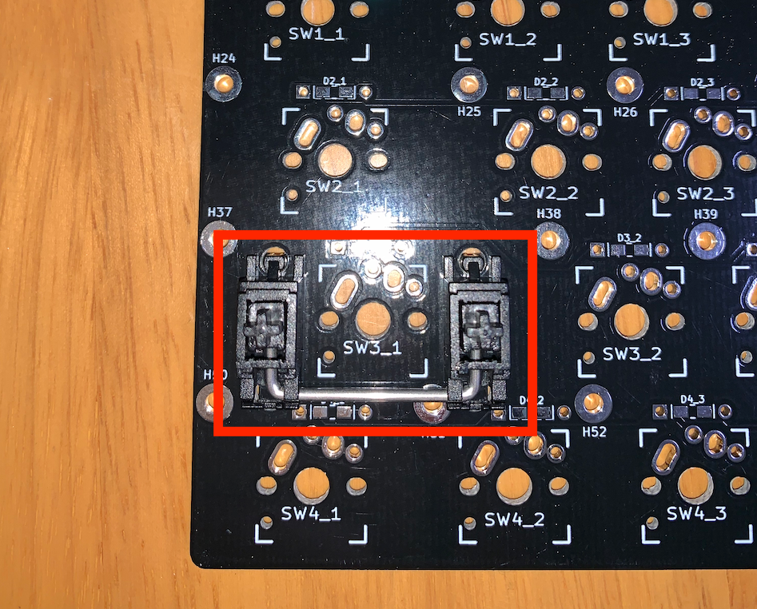
{}

{}

{}

{}
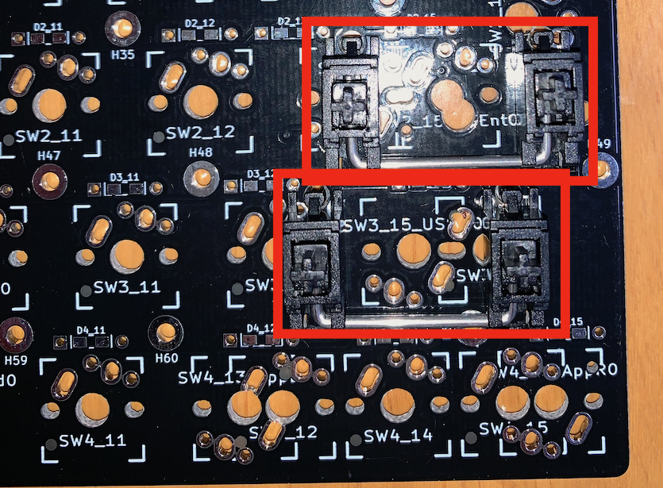
{}

{}

{}

- 6u

{}
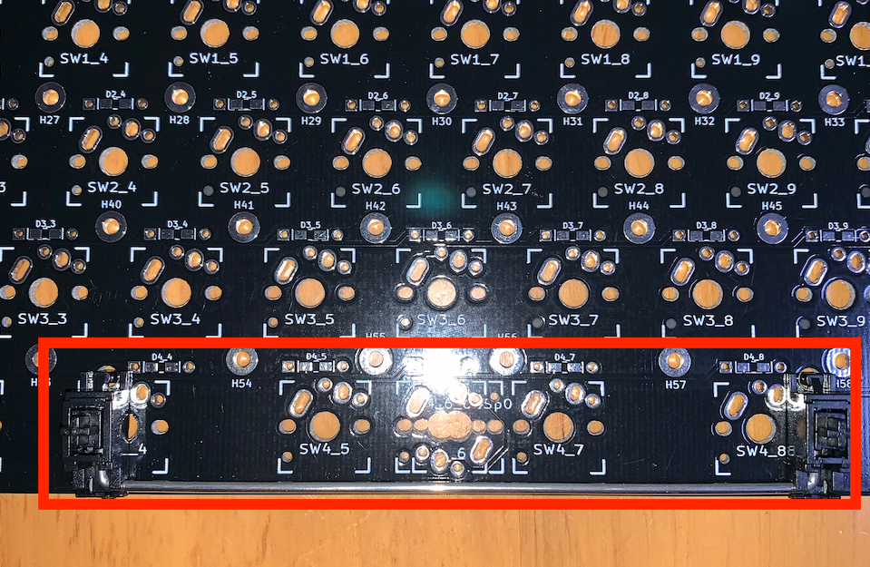
{}

#### それ以外の場合

-1.75u

{}

{}

{}

{}

{}

{}

{}
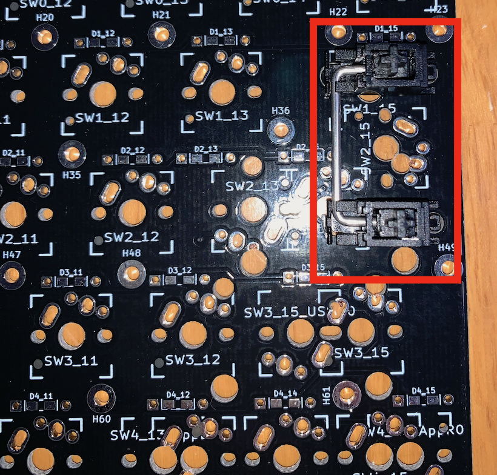
{}

{}

{}

### 4. ネジ類の固定とキースイッチのはんだ付け

使用するバックプレート（2パターン）xキースイッチ（2パターン）の計4パターンあります．

#### 角度のついたバックプレート+Kailh Chocスイッチ使用時

まず，キースイッチをつけたトッププレートをPCBの上に重ね合わせます．

次に，キースイッチの位置が正しいことを確認しながら，キースイッチをはんだ付けします．

その後，キースイッチのキーキャップをつける側（表）からトッププレートとPCBの穴を同時に通すようにネジを入れます．
ネジを入れる位置と個数は任意ですが，一例としては以下の写真の赤く囲んだ箇所です．

{}
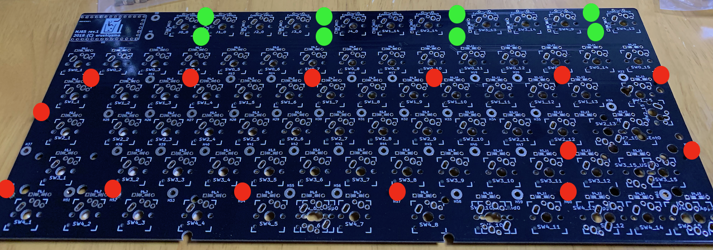
{}

その後，PCB側からネジにナットを取り付けます．
この際，強くナットを回してトッププレートとPCB間の隙間が狭まらないように注意してください．
1mm程度の厚紙をトッププレートとPCB間に挟んで作業すると良いでしょう．

最後に，バックプレートの上にPCBを重ね合わせ，各ネジを表側から垂直に少し力を入れて締めます（タッピング）．

#### 角度のついたバックプレート+Kailh Choc以外のキースイッチ使用時

- いずれ追記します．

#### 角度のつかないバックプレート+Kailh Chocスイッチ使用時

まず，2種類のスペーサーを，PCBの穴を挟み込むように取り付けます．
取り付ける位置と個数は任意ですが，一例としては[角度のついたバックプレート+Kailh Chocスイッチ使用時](#%E8%A7%92%E5%BA%A6%E3%81%AE%E3%81%A4%E3%81%84%E3%81%9F%E3%83%90%E3%83%83%E3%82%AF%E3%83%97%E3%83%AC%E3%83%BC%E3%83%88-kailh-choc%E3%82%B9%E3%82%A4%E3%83%83%E3%83%81%E4%BD%BF%E7%94%A8%E6%99%82-1)の写真の赤く囲んだ箇所です．

{}
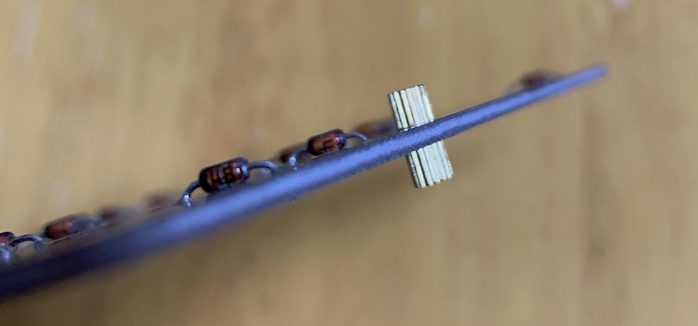
{}

その後，キースイッチをはめ込んだトッププレートをPCBの上に重ね合わせ，先ほど取り付けたスペーサーの上に置きます．
さらに，トッププレートとスペーサーを超低頭ネジで固定します．

{}
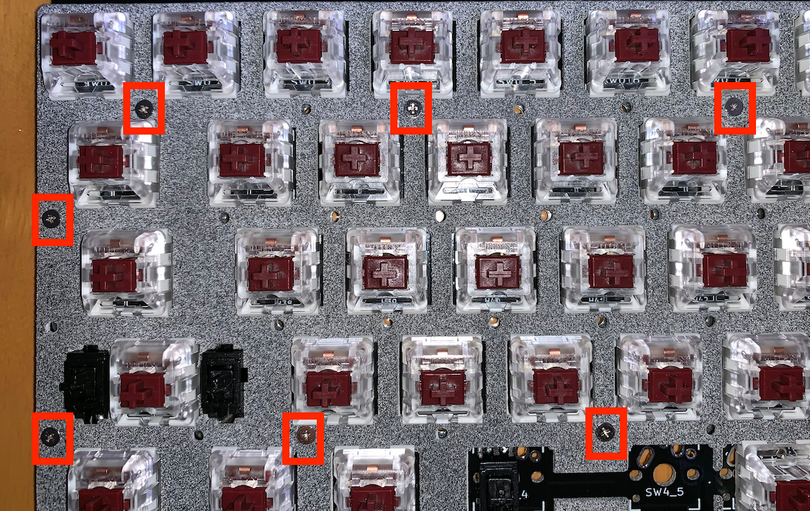
{}

その後，キースイッチをPCBにはんだ付けします．

小皿ネジ用のバックプレートを用いる場合は，ついでバックプレートを穴径が小さい方がPCBの裏側を向くように重ね合わせ，バックプレートとスペーサーを小皿ネジで固定します．

普通の穴のバックプレートを用いる場合は，ついでバックプレートをPCBの裏側と重ね合わせ，バックプレートとスペーサーを超低頭ネジやゴム脚付きのネジで固定します．

#### 角度のつかないバックプレート+Kailh Choc以外のキースイッチ使用時

- いずれ追記します．

### 5. コンスルーのマイコンボードへのはんだ付け，マイコンボードのPCBへの装着

コンスルーのうち1つを切り離し，7ピンのコンスルーをつくります．

{}
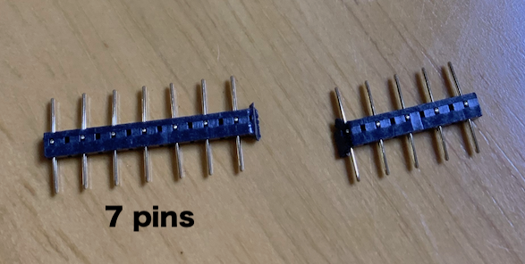
{}

その後，7ピンのコンスルーが短辺になるように，コの字にコンスルーをはんだ付けします．
この際，PCBのコントローラ取り付け部分に先にコンスルーを装着した後にコントローラを装着し，その上ではんだ付けすると失敗しにくいです．

{}
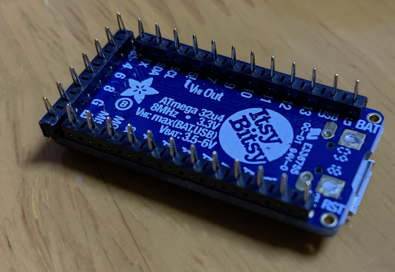
{}

### 6. マイコンボードのPCBへのはめ込み

マイコンボードは，PCBの左上に装着します．

{}
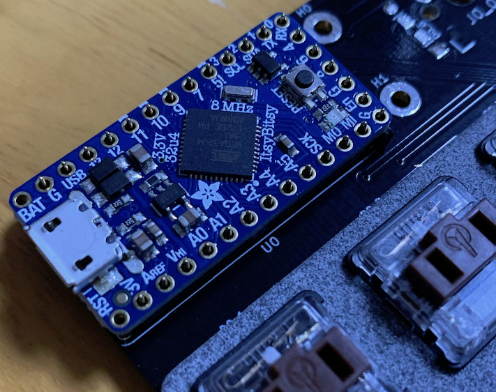
{}

## ファームウェアの書き込み

QMKファームウェアの実行環境があることを想定しています．
実行環境のセットアップは公式の[こちら](https://docs.qmk.fm/#/newbs_getting_started?id=set-up-your-environment)を参照ください．

1. USBケーブルでマイコンボードとPCをつなぐ．
2. ターミナルで`git clone -b MJ65 https://github.com/urushiyama/qmk_firmware.git`
3. ターミナルで`make mj65:<layout>:avrdude`
4. ターミナル上の指示に従い，必要ならばマイコンボードのリセットボタンを押す

`<layout>` には，選択したキーレイアウトに応じた文字列を指定します．
USライク配列なら`us_like`，Default（JIS）配列なら`default`，分割スペース配列なら`split_space`を指定します．
また，右下のキー数を1つ増やしたレイアウトの場合，USライク配列なら`1app_us`，Default（JIS）配列なら`1app`，分割スペース配列なら`1app_split`を指定します．
