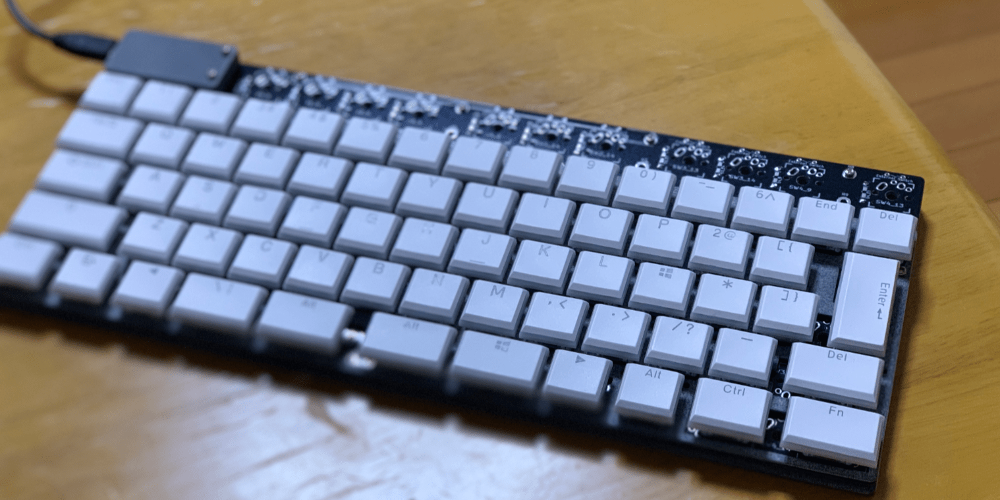

{}

{}

MJ65は某🍎のJISキーボードに対するリスペクトとして設計した自作キーボードです．

ざっくり以下の特長を持ちます：

- Cherry MX互換，Alps互換，Kailh Chocスイッチに対応
- JIS配列を始めとして，分割スペース，USライクな配列をサポート
- オープンソース

<!--more-->

## 製作に必要なもの

[MJ65 PCB data](https://github.com/urushiyama/MJ65-PCB)  
[MJ65 Plate data](https://github.com/urushiyama/MJ65-Plate)  
[MJ65 firmware (QMK fork)](https://github.com/urushiyama/qmk_firmware/tree/MJ65/keyboards/mj65)

この他，コントローラとして[Adafruit ItsyBitsy 32u4 - 3V 8MHz](https://www.adafruit.com/product/3675)を用います．
また，プレートの固定のためChocスイッチでは5 mm，8 mm，および15 mmのM2ネジを使用します．

## あとがき

タッチセンシングの発達やスマートフォンの普及によるタッチスクリーンの一般化により，機構部分が多いため故障率が高く，物理的高さを実装時に要求する物理キーボードは存続の岐路に立っています．
また，某🍎がラップトップに搭載するキーボードをタッチスクリーンに置き換えるのではないか，という憶測を耳にします．
しかし，もし某🍎が物理キーボードを製造しなくなった場合，FキーとJキーの中間線に対して親指周辺のキーが左右対称なMac用物理キーボードの入手は困難になってしまいます．
MJ65には，この対称的なレイアウトが存続してほしい，という願いが込められています．
