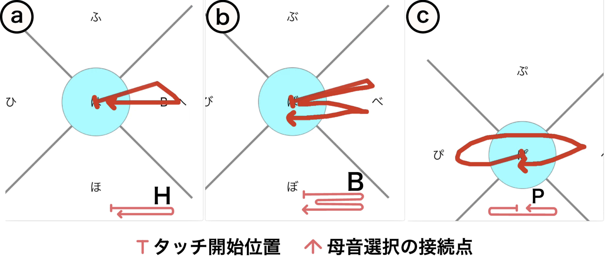
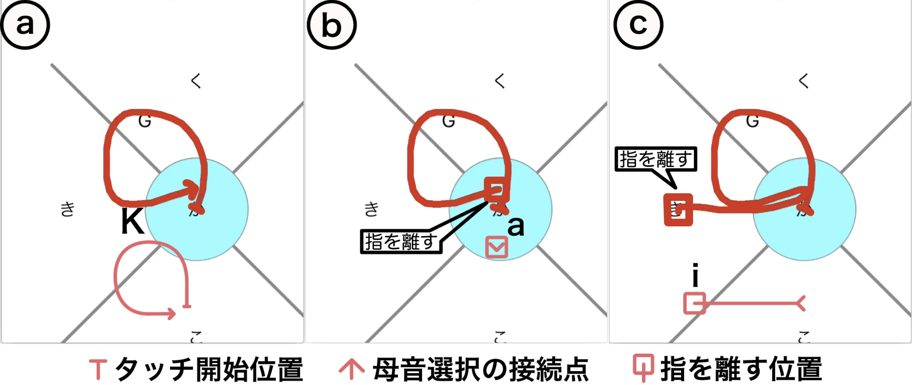
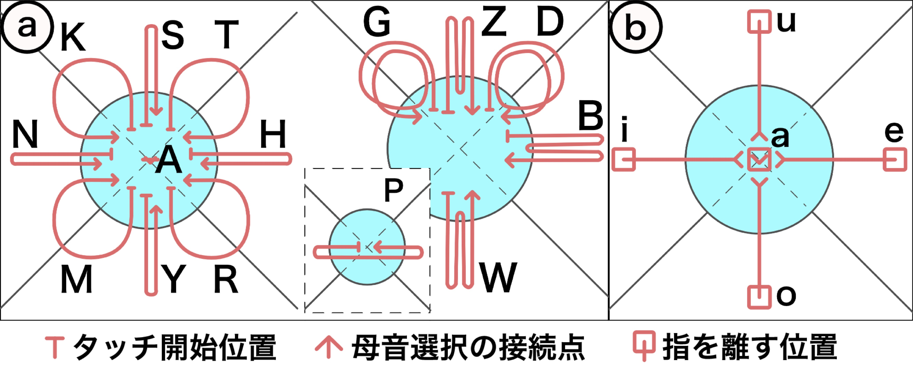

## 概要

手元を見ずにスマートフォンによる文字入力が行えれば，ユーザは歩行中あるいは会話中にスマートフォンにてメモを取ることができる．しかし，視覚以外の感覚によりタッチ位置をタッチ前に知覚することは困難であるため，キーを視認する必要がある．
我々は文字入力時に手元の視認が不要な，指の軌跡に基づくスマートフォン向けのかな文字入力手法を提案する．
提案手法は，タッチ位置を基点とする円形領域および外側の上下左右4方向の領域を指が一筆書きにて通過する順序に基づいて，文字の子音および母音を決定するため，正確さの粗いタッチ操作に対して堅牢な文字入力が期待される．

<!--more-->

