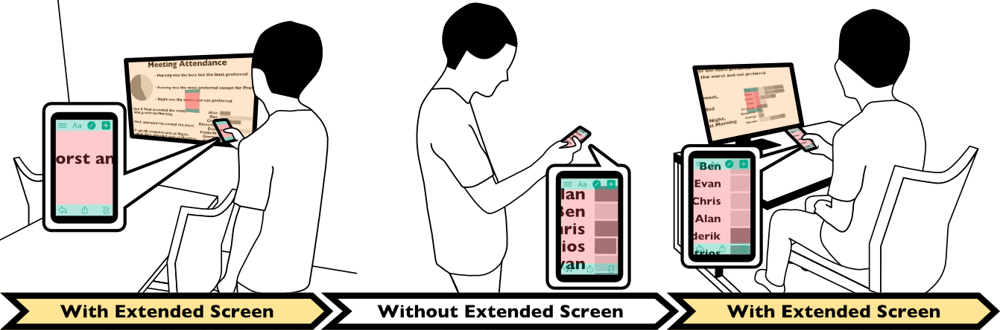

## ABSTRACT

There are some techniques to show the smartphone’s content on an external display in large. However, since smartphones are designed for mobility, a seamless interaction is necessary to make the best use of external display by a smartphone. We are currently exploring the feasibility of another technique, which we call Screen Extension. Our technique seamlessly adds display spaces to a smartphone using an external display, allowing users to use displays available in many places. To test search performance with Screen Extension, we conducted a pilot study; which suggested that Screen Extension helps users to search content faster.

